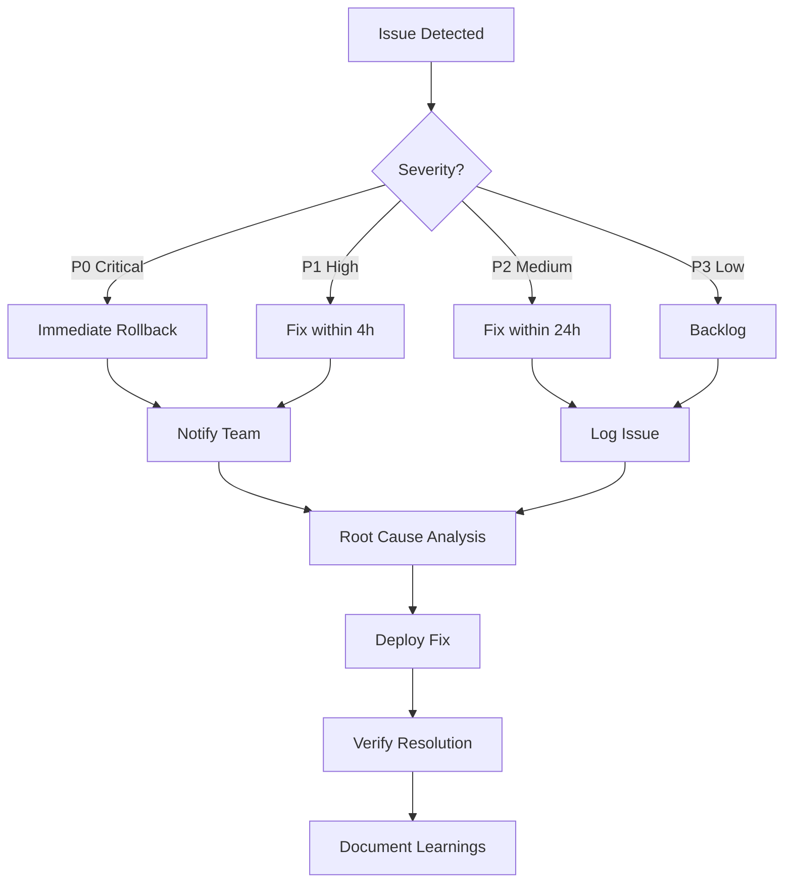

# 🚀 Deployment Guide - Hotel Agent Meta Ads Automation

**Target Environment:** Production
**Deployment Date:** 2025-11-21
**Version:** 3.0 FINAL

---

## 📋 Pre-Deployment Checklist

### ✅ Requirements Verification

- [ ] Meta Business Account active
- [ ] Meta App created and approved
- [ ] App permissions: `ads_management`, `ads_read`
- [ ] Access Token generated (production level)
- [ ] Ad Account ID available
- [ ] Google Sheets document created
- [ ] Google OAuth2 credentials configured
- [ ] n8n instance running (v1.0+)
- [ ] Team members notified

---

## 🔧 Step-by-Step Deployment

### Step 1: Backup Existing Workflow (if applicable)

```bash
# Export current workflow from n8n
n8n export:workflow --id=<workflow-id> --output=backup-$(date +%Y%m%d).json

# Or manually:
# n8n UI > Workflows > Select workflow > Export
```

### Step 2: Import New Workflow

#### Option A: n8n UI (Recommended)
1. Open n8n UI
2. Click **Workflows** > **Import from File**
3. Select: `Hotel Agent - Automationv3 FINAL.json`
4. Click **Import**
5. Workflow will appear in list

#### Option B: n8n CLI
```bash
n8n import:workflow --input="Hotel Agent - Automationv3 FINAL.json"
```

### Step 3: Configure Credentials

#### 3.1 Google Sheets OAuth2

1. n8n UI > **Credentials** > **Add Credential**
2. Type: **Google Sheets OAuth2 API**
3. Name: `GoogleAuth`
4. Click **Connect my account**
5. Authorize Google account
6. Save

#### 3.2 Meta Access Token

**CRITICAL:** Never hardcode access token in workflow!

##### Option A: Environment Variables (Recommended)
```bash
# Add to n8n environment
export META_ACCESS_TOKEN="EAAxxxxxxxxxxxxxxxxxxxxxxxx"
export AD_ACCOUNT_ID="act_123456789"

# Restart n8n
systemctl restart n8n
```

##### Option B: n8n Credentials Store
1. n8n UI > **Credentials** > **Add Credential**
2. Type: **HTTP Header Auth**
3. Name: `MetaAccessToken`
4. Header Name: `Authorization`
5. Header Value: `Bearer EAAxxxxxxxxxxxxxxxxxxxxxxxx`
6. Save

**Update HTTP nodes:**
```javascript
// In all HTTP Request nodes, change URL from:
https://graph.facebook.com/v23.0/...?access_token={{ $env.META_ACCESS_TOKEN }}

// To:
https://graph.facebook.com/v23.0/...
// And add Authentication: MetaAccessToken credential
```

### Step 4: Update Workflow Parameters

#### 4.1 Google Sheets Trigger Node

```yaml
Node: "Meta Ads Automation"
Parameters:
  Document ID: "1MQlMgOSWr2eE8lWBUFRkPIwF8ilbiPACxzxkrYAK0ek"
  Sheet Name: "Son"
  Range: "A2:AZ20000"
  Poll Times: Every 30 minutes
  Credential: GoogleAuth
```

#### 4.2 Update Account ID References

Search for `account_id` and `ACCOUNT_ID` in all nodes:

```javascript
// Replace hardcoded IDs with environment variable
act_123456789 → act_{{ $env.AD_ACCOUNT_ID }}
```

**Nodes to check:**
1. Camp Budget - Camp. Create
2. Ad Set Budget - Camp. Create
3. Campaign Budget - Ad Set Create
4. AD Set Budget - Ad Set Create
5. Campaign Budget - Ad Create1
6. Ad Set Budget - Ad Create
7. All Update nodes

### Step 5: Verify Node Connections

Run validation script:

```bash
python3 analyze_workflow.py
```

**Expected output:**
```
✅ All nodes are connected
Total Connections: 65
Total Nodes: 64
```

If errors found, fix in n8n UI.

### Step 6: Test Execution (Staging)

#### 6.1 Create Test Sheet Row

In Google Sheets, add test data:

```yaml
Campaign Name: "TEST - Delete After"
Objective: "OUTCOME_TRAFFIC"
Buying Type: "AUCTION"
Status (Campaign): "PAUSED"
Budget: "Campaign Budget"
Campaign Budget: 10  # Minimum test budget

Ad Set Name: "TEST AdSet"
Status (Ad Set): "PAUSED"
Start Time: 2025-01-01T00:00:00Z
Billing Event: "LINK_CLICKS"
Optimization Goal: "LINK_CLICKS"
Bid Strategy: "LOWEST_COST_WITHOUT_CAP"

Ad Name: "TEST Ad"
Status (Ad): "PAUSED"
Primary Text: "Test ad - ignore"
Headline: "Test"
Description: "Test"
URL: https://www.etstur.com
Platform: "facebook"
Call To Action: "LEARN_MORE"
FB Page_ID: <your_page_id>
IG User_ID: <your_ig_id>
Placements: "Facebook Feed"

Action: create_campaign
```

#### 6.2 Manual Trigger

1. n8n UI > Open workflow
2. Click **Execute Workflow**
3. Monitor execution

#### 6.3 Verify Results

Check:
- [ ] Execution successful (green)
- [ ] Campaign ID written to Google Sheets
- [ ] Ad Set ID written to Google Sheets
- [ ] Ad ID written to Google Sheets
- [ ] Action changed to "none"
- [ ] Campaign visible in Meta Ads Manager
- [ ] Status is "PAUSED"

#### 6.4 Clean Up

Delete test campaign from Meta Ads Manager.

### Step 7: Enable Workflow

1. n8n UI > Workflow
2. Toggle **Active** switch to ON
3. Confirm activation

**Workflow now runs automatically every 30 minutes!**

### Step 8: Monitor First 24 Hours

#### 8.1 Set Up Monitoring

```bash
# Watch n8n logs
tail -f ~/.n8n/logs/n8n.log | grep "Hotel Agent"

# Or if using Docker:
docker logs -f n8n-container | grep "Hotel Agent"
```

#### 8.2 Check Metrics

Monitor:
- Execution success rate
- Execution duration
- API response times
- Error messages

#### 8.3 Alert Thresholds

Set alerts for:
- Error rate > 2%
- Execution time > 60s
- API timeout > 3 occurrences

---

## 🔍 Post-Deployment Verification

### Verification Checklist

#### ✅ Workflow Level
- [ ] Workflow is **Active**
- [ ] Trigger polling every **30 minutes**
- [ ] All credentials are **valid**
- [ ] All nodes are **connected**
- [ ] No **error badges** on nodes

#### ✅ Execution Level
- [ ] Test execution **successful**
- [ ] Campaign created on **Meta**
- [ ] IDs written to **Google Sheets**
- [ ] Action reset to **"none"**
- [ ] No errors in **execution log**

#### ✅ Integration Level
- [ ] Google Sheets trigger **works**
- [ ] Meta API calls **succeed**
- [ ] Retry logic **activates** on error
- [ ] Error handling **catches** exceptions
- [ ] Validation **prevents** bad data

#### ✅ Team Level
- [ ] Team members **trained**
- [ ] Documentation **shared**
- [ ] Support channel **created**
- [ ] Feedback mechanism **established**

---

## 🚨 Rollback Procedure

If issues occur, follow rollback:

### Emergency Rollback

1. **Deactivate Workflow Immediately**
   ```
   n8n UI > Workflow > Active: OFF
   ```

2. **Restore Previous Version**
   ```bash
   n8n import:workflow --input=backup-20251121.json
   ```

3. **Verify Restoration**
   - Test old workflow
   - Check Meta API connectivity
   - Confirm Google Sheets trigger

4. **Notify Team**
   ```
   Subject: [URGENT] Workflow Rolled Back
   Body: New workflow caused issues. Reverted to previous version.
         Current status: OLD WORKFLOW ACTIVE
   ```

5. **Investigate Root Cause**
   - Review error logs
   - Identify breaking change
   - Plan fix

6. **Schedule Re-Deployment**
   - Fix issues in dev environment
   - Test thoroughly
   - Deploy at off-peak hours

---

## 📊 Monitoring & Alerting Setup

### Option 1: n8n Built-in Monitoring

Enable workflow execution notifications:

```yaml
Settings:
  - Execution Success: Notify on Slack
  - Execution Error: Notify on Slack + Email
  - Execution Timeout: Alert immediately
```

### Option 2: External Monitoring (Recommended)

#### Grafana + Prometheus

```yaml
# prometheus.yml
scrape_configs:
  - job_name: 'n8n'
    static_configs:
      - targets: ['localhost:5678']
    metrics_path: '/metrics'

# Alert rules
groups:
  - name: n8n_alerts
    rules:
      - alert: WorkflowHighErrorRate
        expr: rate(n8n_workflow_errors_total[5m]) > 0.02
        labels:
          severity: warning
        annotations:
          summary: "High error rate in workflow"

      - alert: WorkflowSlowExecution
        expr: n8n_workflow_execution_duration_seconds > 60
        labels:
          severity: info
        annotations:
          summary: "Workflow execution taking too long"
```

#### Slack Webhook

Add error notification node:

```javascript
// New node: "Error Notifier"
// Type: HTTP Request
// Method: POST
// URL: https://hooks.slack.com/services/YOUR/WEBHOOK/URL

{
  "text": "❌ Hotel Agent Workflow Error",
  "blocks": [
    {
      "type": "section",
      "text": {
        "type": "mrkdwn",
        "text": "*Error Details:*\n" +
                `Node: ${$json.node}\n` +
                `Message: ${$json.error_message}\n` +
                `Timestamp: ${$json.timestamp}`
      }
    }
  ]
}
```

---

## 🔐 Security Best Practices

### 1. Access Token Management

❌ **DON'T:**
```javascript
// Hardcoded in workflow
const access_token = "EAAxxxxxxxx";
```

✅ **DO:**
```javascript
// Environment variable
const access_token = $env.META_ACCESS_TOKEN;
```

### 2. Sensitive Data Logging

❌ **DON'T:**
```javascript
console.log(`Budget: ${budget}, Phone: ${phone}`);
```

✅ **DO:**
```javascript
console.log(`Budget: ${budget > 0 ? '[REDACTED]' : 'N/A'}`);
console.log(`Phone: ${phone ? '[REDACTED]' : 'N/A'}`);
```

### 3. Google Sheets Permissions

Limit access to:
- Hotel Agent team members only
- Read/Write permissions required
- No public sharing

### 4. n8n Instance Security

```yaml
Security Measures:
  - SSL/TLS: Enabled
  - Authentication: Required
  - API Rate Limiting: Enabled
  - Webhook Authentication: Secret token
  - IP Whitelist: Configured
```

---

## 🧪 Testing Matrix

### Test Scenarios

| Scenario | Input | Expected Output | Priority |
|----------|-------|-----------------|----------|
| **Create CBO** | Campaign Budget = 500 | Campaign + AdSet + Ad created | P0 |
| **Create ABO** | Ad Set Budget = 100 | Campaign (no budget) + AdSet (budget) + Ad | P0 |
| **Update Status** | PAUSED → ACTIVE | Status updated only | P0 |
| **Invalid Budget** | Budget = "abc" | Validation error, no API call | P0 |
| **Invalid Phone** | Phone = "123" | Validation error | P1 |
| **Sync** | Sync = TRUE | Data fetched from Meta | P1 |
| **Retry** | Network error | 4 retries executed | P1 |
| **Rate Limit** | 200+ calls/hour | Backoff, retry | P2 |

### Test Commands

```bash
# Validate workflow structure
python3 analyze_workflow.py

# Test individual node
n8n execute --id=<node-id> --input=test_data.json

# Load test (simulate 10 concurrent rows)
python3 load_test.py --rows=10

# Integration test
python3 integration_test.py --full
```

---

## 📞 Support & Escalation

### Issue Resolution Flow



### Severity Levels

**P0 - Critical**
- Workflow completely broken
- Meta API authentication failure
- Data loss
- **Response Time:** Immediate
- **Escalation:** CTO + Team Lead

**P1 - High**
- Partial functionality broken
- High error rate (>5%)
- Performance degradation
- **Response Time:** 4 hours
- **Escalation:** Team Lead

**P2 - Medium**
- Minor bugs
- UI issues
- Non-critical features
- **Response Time:** 24 hours
- **Escalation:** Developer

**P3 - Low**
- Enhancement requests
- Documentation updates
- Nice-to-have features
- **Response Time:** Next sprint
- **Escalation:** Backlog

### Contact Information

```yaml
Team Lead: batuhan.celik@etstur.com
Developer: mert.pektas@etstur.com
Designer: ece.sarac@etstur.com

Slack Channel: #hotel-agent-automation
Email: dijital.pazarlama@etstur.com
Phone (Emergency): +90 XXX XXX XX XX
```

---

## 📚 Additional Resources

### Documentation
- [Meta Marketing API Docs](https://developers.facebook.com/docs/marketing-api)
- [n8n Official Docs](https://docs.n8n.io)
- [Google Sheets API](https://developers.google.com/sheets/api)

### Internal Resources
- `README.md` - User guide
- `ANALYSIS_REPORT.md` - Technical analysis
- `workflow_analysis.json` - Detailed node analysis
- `http_analysis.json` - HTTP node configuration
- `code_analysis.json` - Code node analysis

### Training Materials
- Video: "Hotel Agent Automation - Quick Start" (TBD)
- Slides: "Google Sheets Best Practices" (TBD)
- FAQ: Common Issues and Solutions (TBD)

---

## ✅ Deployment Sign-Off

### Approval Checklist

- [ ] **Technical Review:** Workflow tested successfully
- [ ] **Security Review:** Credentials secured, no sensitive data exposed
- [ ] **Performance Review:** Execution time < 60s, error rate < 2%
- [ ] **Documentation Review:** README, guides complete
- [ ] **Team Training:** All members trained
- [ ] **Backup Prepared:** Previous version backed up
- [ ] **Rollback Plan:** Documented and understood
- [ ] **Monitoring Configured:** Alerts set up

### Sign-Off

```yaml
Prepared By: Claude (AI Assistant)
Reviewed By: ____________________
Approved By: ____________________
Date: 2025-11-21
Status: ✅ READY FOR DEPLOYMENT
```

---

**Deployment Guide v3.0 FINAL**
**Last Updated:** 2025-11-21
**Next Review:** 2025-02-21 (3 months)
